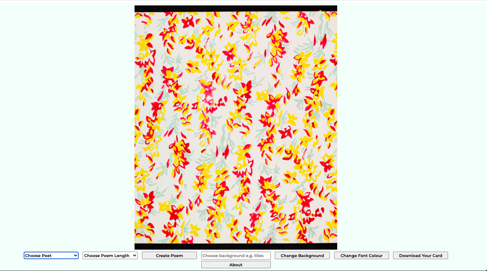

## General Assembly Project 1.5 

# **Code_Poetry**

Timeframe: 

1 Weekend

Goal:

A weekend-long solo project to build a simple app using React, AJAX, and RESTful APIs.

Technologies Used:

* HTML5 
* CSS3
* JavaScript (ES6)
* React
* Git
* GitHub
* Google Fonts
* APIs
* Insomnia
* HTML2Canvas

In short:

Code_Poetry is a simple, one-page app inspired by a simple need: people want cool, individualized and utterly unique greetings cards. I wanted to find a way of making these using React and APIs. Also, after a little digging around online, I got a little more help from a fantastic external library, HTML2Canvas. 

Use the deployed version here:

<a href='https://clem-code.github.io/project-1.5/' target='_blank' >https://clem-code.github.io/project-1.5/<a>

## The Concept

I had the weekend for the project and I had only been learning about React and APIs for a week at this point so the design was necessarily lean and pared back. The mandate was to use an API of our choice and build the app using React. Everything else was up to us to. Early on, I decided I wanted to do something with the Poetry DB API. I've always been interested in the concept of automatic writing: the idea that literature can be intuitive, experimental, and spontaneous. I wanted to use code to make something like a digital version of automatic writing. The idea was to allow the user to choose a category of poetry and a length of poem and then use a little code to access the Poetry DB API and then randomly 'write' a new poem. For instance, if the user chose 'Emily Dickinson' and '10' then everytime they pressed the button, a randomly generated ten line Emily Dickinson poem would appear on-screen. 

I wanted to combine this random poetry with some randomized stylings. First off, I added a simple piece of code, also tied to a button, that would randomize the font colour and the background colour of the poetry. But I wanted to do more. So I added another API: the Victoria and Albert Museum API. The V&A has a vast and eclectic collection. I added a simple search function that would pass through search terms into the API and then generate a background accordingly. For instance, if a user types in 'lilies', then a piece from the V&A which has the keyword 'lilies' will appear as the background art!  

## Building It

The extent of the app is a container which constitutes the 'canvas' -- basically a div which holds the lines of poetry and whose background is randomly generated depending on what the user searches for. Beneath the canvas are a series of buttons which guide the user to building their own poem and choosing the background design. At the very end is a 'Download Card' button which lets them download their custom-made card.

The APIs: I was new to using APIs and this was the first time I was independently trying to incorporate API data into a visual interface. Overall, I didn't encounter too many difficulties. The V&A and the Poetry DB APIs are pretty easy to use. Neither require keys and both had in-depth and easily-comprehensible documentation. I used Insomnia to get comfortable with how they organized their data, all of which was fairly straightforward. 

*An example of a fetch from the Poetry DB API*

	 useEffect(() => {
	    const shakespeareArr = []
	    fetch('https://poetrydb.org/author,linecount/Shakespeare;14/lines')
	      .then(resp => resp.json())
	      .then(data => {
	        data.map((poem, index) => {
	          return shakespeareArr.push(poem.lines)
	        })
	      })
	    shakespeareCreate(shakespeareArr)
	  },[])
  
In some ways it was more complicated coding out the actual functionality than it was the fetch requests. I was still getting used to the concept of state as well as the syntax of React.

*The code that fetches a random image that matches the user search term from the V&A API*

	function fetchCanvas(search) {
	    const searchTerm = search.replaceAll(' ', '-')
	    fetch(`https://cors-anywhere.herokuapp.com/http://www.vam.ac.uk/api/json/museumobject/search?q=${searchTerm}&images=1&limit=45`)
	      .then(resp => resp.json())
	      .then(data => {
	        const imager = data.records[Math.floor(Math.random() * 45)].fields.primary_image_id
	        const imagerTag = imager.slice(0, 6)
	        updateBackground(`http://media.vam.ac.uk/media/thira/collection_images/${imagerTag}/${imager}.jpg`)
	      })
	  }
	  [])

The crowning achievement was the functionality that allows the user to download their card. I couldn't have done this without the HTML2Canvas package made by developer <a href='https://hertzen.com/'>Niklas von Hertzen</a>. With a little help from Stack Overflow I was able to get this working pretty quickly. It was the first time I had found, downloaded, and utilized an external library without any assistance so I was over the moon when it all worked!

*The code that makes use of the HTML2Canvas library to download the card the user has made*

	function canvasMaker() {
	    html2canvas(document.getElementById('unblur'), { allowTaint: true, useCORS: true }).then(function (canvas) {
	      var link = document.createElement("a");
	      document.body.appendChild(link);
	      link.download = "code_poem.png";
	      link.href = canvas.toDataURL("image/png");
	      link.target = '_blank';
	      link.click();
	    });
	  }

*An example of a downloaded card*

### _Wins_

Getting used to React...it was all still very new to me!

Finding and utilizing the HTML2Canvas package -- this made the app in my mind.

Clean code -- I thought the final code was nice and lean.

### _Challenges_

I wanted to use the Met Museum API as well as the V&A one. This was able to work fine...until it came to the HTML2Canvas functionality when the Met images wouldn't load. I spent many hours trying to figure out what was going on but could not get to the bottom of it!

### _Potential Improvements_

Expanding the variety of poems available.

Getting access to additional APIs to generate the background art.

Mobile compatibility.

### _Key Takeaways_

This project was the first time I was working on an app without any support. It was really scary at first, but it also made me get used to falling back on my own inventiveness when it came to problem-solving. This was particularly the case with getting HTML2Canvas to work which was a real challenge!
On the technical side, it was still very early days for me in terms of React. Getting some time in with it and learning how to use state and hooks was really valuable.

